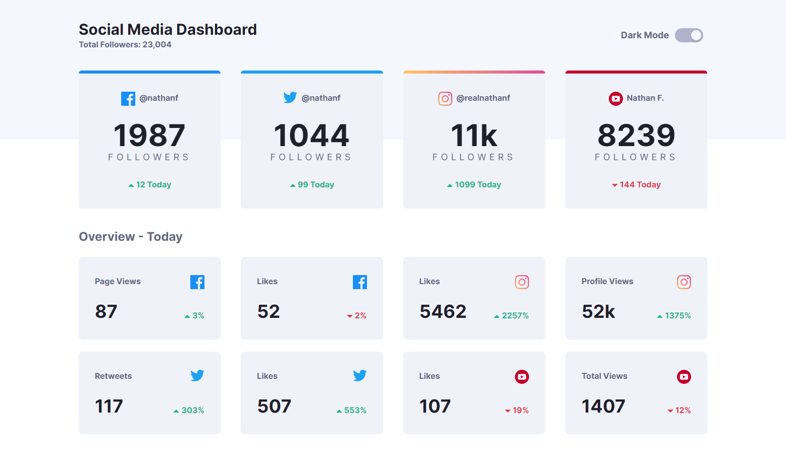
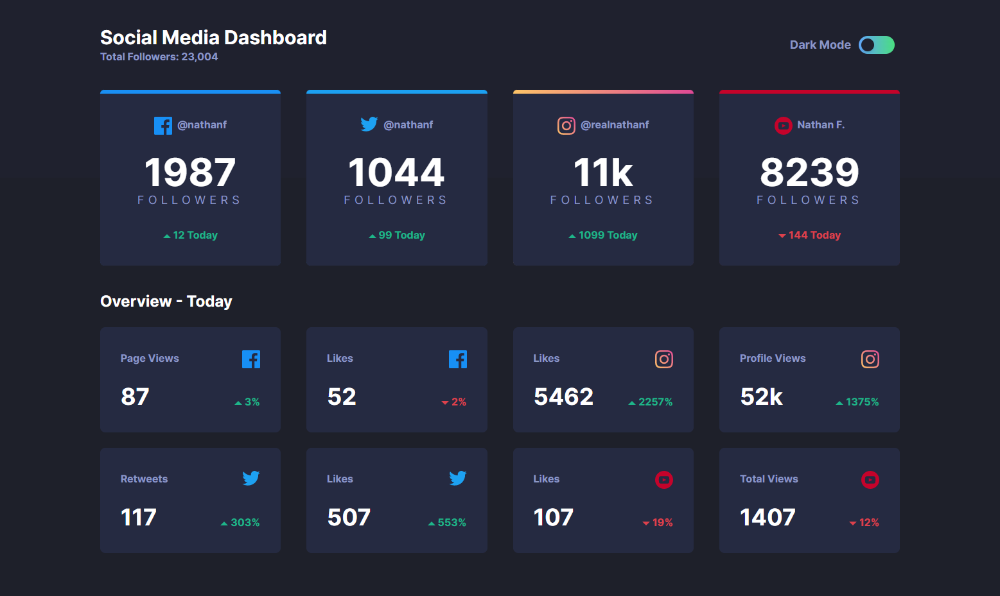

# Frontend Mentor - Social media dashboard with theme switcher solution

This is a solution to the [Social media dashboard with theme switcher challenge on Frontend Mentor](https://www.frontendmentor.io/challenges/social-media-dashboard-with-theme-switcher-6oY8ozp_H). Frontend Mentor challenges help you improve your coding skills by building realistic projects. 

## Overview

### The challenge

Users should be able to:

- View the optimal layout for the site depending on their device's screen size
- See hover states for all interactive elements on the page
- Toggle color theme to their preference

### Screenshot

### Links

- [Frontend Mentor: Solution URL]()
- [Vercel: Live Site URL]()

## My process

### Built with

- Semantic HTML5 markup
- CSS custom properties
- Flexbox
- CSS Grid
- Mobile-first workflow
- Tailwind CSS
- [React](https://reactjs.org/) - JS library

## What I learned

It took me a lot longer to finish this challenge because I completely underestimated how much work would go into a theme toggle-switch. Thankfully however, as I choose harder challenges to work on, I force myself to learn and improve my frontend development.

At first, I tried to learn Material UI and Chakra UI, but I felt that although there were pre-built components, it was difficult to fight against the default settings to get the design that I was looking for. I ended up choosing to learn and use Tailwind CSS for this project, and I don't regret anything. I absolutely enjoyed using Tailwind to design this page because I didn't need to think of class names, modifying one element doesn't break everything, and I have the ability to easily and freely customize my React components.

I will continue to learn and use Tailwind in my future challenges.

## Continued development

I'm looking forward to take on a fullstack application challenge, but I feel like I need to practice more with small javascript applications. I felt like this was especially challenging because I didn't know anything about storing data in localStorage or how to build a small toggle switch. I'm looking forward to building more small components that are unexpectedly challenging, as I'm improving myself and growing as a frontend developer.

---

### Useful resources

- [Tailwind CSS Documentation](https://tailwindcss.com/docs/)
- [Fireship Tailwind CSS Tutorial](https://www.youtube.com/watch?v=pfaSUYaSgRo&ab_channel=Fireship)

## Author
Ian Wu

- Frontend Mentor - [@iannnop](https://www.frontendmentor.io/profile/iannnop)
- LinkedIn - [@iannnop](https://www.linkedin.com/in/iannnop/)
- Instagram - [@iannnop_frontend](https://www.instagram.com/iannnop_frontend/)
- Twitter - [@iannnop](https://www.twitter.com/iannnop)